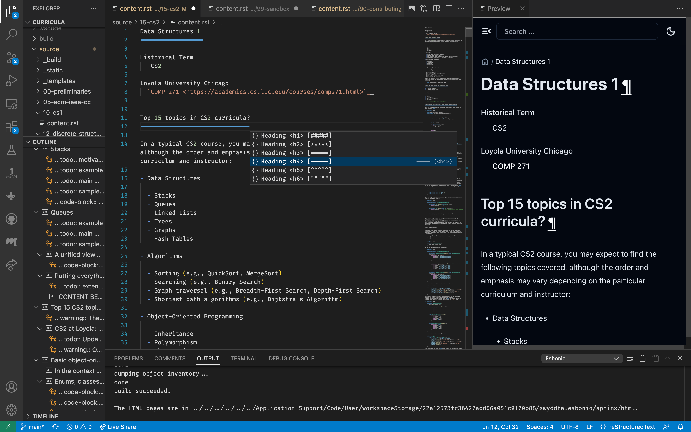

How to Contribute
=================

Anyone is welcome to contribute to this project as long as you meet some basic criteria.

Requirements
------------

- interest in ACM/IEEE curricular framework
- being in touch with modern computer science practice
- appreciation and understanding of open source culture
- GitHub account
- ORCID ID

Contribution process
--------------------

- fork a repo
- make pull requests
- attend in-person or virtual meetings to discuss next steps and other aspects of the project

.. todo:: Set up an issue template for contributors.

Sample tool stack
-----------------

- Visual Studio Code
- extensions: Esbonio by Swyddfa (comes up when searching for sphinx but not restructured), reStructuredText by Tatsuya (optional, for additional syntax-directed editing support with headings etc.)
- requires nonvirtual install of Python Sphinx and theme packages (unless you want to launch VS Code manually within a venv) - see requirements.txt in this repo
- the Esbonio language server will rebuild the html version very quickly upon save
- supports passive outline in explorer pane
- preview within VS Code works and refreshes quasi-instantly (but a bit suboptimal for long documents because it goes back to the top after each HTML rebuild)
- you can also see the local file path of the html in the output window in case you want to view it in an external browser
- optional Botrush Edge/Chrome browser extension for downloading ChatGPT sessions in varioius formats including Markdown
- pandoc for converting Markdown and other formats to reStructuredText

